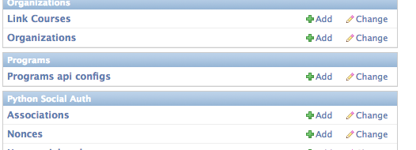
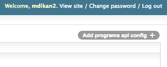
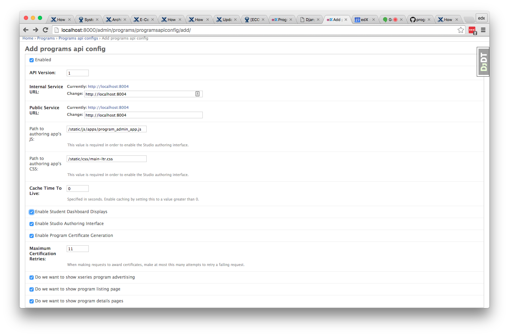

Getting Started
===============

If you have not already done so, create/activate a `virtualenv`_. Unless otherwise stated, assume all terminal code
below is executed within the virtualenv.

.. _virtualenv: https://virtualenvwrapper.readthedocs.org/en/latest/

Install dependencies
--------------------
Dependencies can be installed via the command below.

.. code-block:: bash

    $ make requirements

Local/Private Settings
----------------------
When developing locally, it may be useful to have settings overrides that you do not wish to commit to the repository.
If you need such overrides, create a file :file:`programs/settings/private.py`. This file's values are
read by :file:`programs/settings/local.py`, but ignored by Git. 
For an example, see `programs/settings/private.py.example`.

LMS Admin
---------

Continuing configuration for the programs service integration will require access to the LMS Django admin.
If you don't already have access, please follow the `LMS Django admin`_ instructions on the wiki.  Once you have
access, you will be able to configure OIDC and the API configuration necessary for the LMS to use the programs service.

.. _LMS Django admin: https://openedx.atlassian.net/wiki/pages/viewpage.action?pageId=94306332

Configure edX OpenID Connect (OIDC)
-----------------------------------
This service relies on the edX OIDC (`OpenID Connect`_) authentication provider for login. Note that OIDC is built atop
OAuth 2.0, and this document may use the terms interchangeably. Under our current architecture the LMS serves as our
authentication provider.

Configuring Programs to work with OIDC requires registering a new client with the authentication
provider and updating the Django settings for this project with the client credentials.

Decide on a port number, and use it below for the OAuth configuration.  We'll use 8004 in our examples, but you can
choose whatever is best suited for your local environment.

.. _OpenID Connect: http://openid.net/specs/openid-connect-core-1_0.html

A new OAuth 2.0 client can be created at ``http://127.0.0.1:8000/admin/oauth2/client/``.

    1. Click the :guilabel:`Add client` button.
    2. Leave the user field blank.
    3. Specify the name of this service, ``Programs``, as the client name.
    4. Set the :guilabel:`URL` to the root path of this service: ``http://localhost:8004/``.
    5. Set the :guilabel:`Redirect URL` to the OIDC client endpoint: ``http://localhost:8004/complete/edx-oidc/``.
    6. Copy the :guilabel:`Client ID` and :guilabel:`Client Secret` values. They will be used later.
    7. Select :guilabel:`Confidential (Web applications)` as the client type.
    8. Click :guilabel:`Save`.

Your newly-created client must also be designated as trusted. Trusted clients bypass the user consent form typically
displayed after validating the user's credentials. Create a new trusted client at ``http://127.0.0.1:8000/admin/oauth2_provider/trustedclient/add/``.

    1. Select your newly-created client's redirect URL from the dropdown.
    2. Click ``Save``.

Now that you have the client credentials, you can update your settings (ideally in
:file:`programs/settings/private.py`). The table below describes the relevant settings.

+-----------------------------------------------------+----------------------------------------------------------------------------+--------------------------------------------------------------------------+
| Setting                                             | Description                                                                | Value                                                                    |
+=====================================================+============================================================================+==========================================================================+
| SOCIAL_AUTH_EDX_OIDC_KEY                            | OAuth 2.0 client key                                                       | (This should be set to the value generated when the client was created.) |
+-----------------------------------------------------+----------------------------------------------------------------------------+--------------------------------------------------------------------------+
| SOCIAL_AUTH_EDX_OIDC_SECRET                         | OAuth 2.0 client secret                                                    | (This should be set to the value generated when the client was created.) |
+-----------------------------------------------------+----------------------------------------------------------------------------+--------------------------------------------------------------------------+
| SOCIAL_AUTH_EDX_OIDC_URL_ROOT                       | OAuth 2.0 authentication URL                                               | http://127.0.0.1:8000/oauth2                                             |
+-----------------------------------------------------+----------------------------------------------------------------------------+--------------------------------------------------------------------------+
| SOCIAL_AUTH_EDX_OIDC_ID_TOKEN_DECRYPTION_KEY        | OIDC ID token decryption key. This value is used to validate the ID token. | (This should be the same value as SOCIAL_AUTH_EDX_OIDC_SECRET.)          |
+-----------------------------------------------------+----------------------------------------------------------------------------+--------------------------------------------------------------------------+

Run migrations
--------------
Local installations use SQLite by default. If you choose to use another database backend, make sure you have updated
your settings and created the database (if necessary). Migrations can be run with `Django's migrate command`_.

.. code-block:: bash

    $ python manage.py migrate

The Programs repository provides a fixture containing sample data. This fixture can be used to pre-populate the database with sample data when setting up the service for development or load testing. The fixture sets up two organizations with a program apiece. Each program contains two course codes, and each course code contains two runs. If you want to use it, load the data from the fixture as follows:

.. code-block:: bash

    $ python manage.py loaddata sample_data

If you change the Programs schema, please update the fixture. You can do so by installing the fixture on a clean database, applying your new migrations, updating the data as necessary, then running the following command to overwrite the fixture:

.. code-block:: bash

    $ python manage.py dumpdata programs --indent 4 > programs/apps/programs/fixtures/sample_data.json

.. _Django's migrate command: https://docs.djangoproject.com/en/1.8/ref/django-admin/#django-admin-migrate

Asset Pipeline
---------------

Static files for Programs are managed using gulp-sass, RequireJS and r.js, Django's collectstatic, and django-compressor. gulp-sass compiles Sass to CSS. RequireJS and r.js are used to manage JavaScript dependencies and optimize CSS. django-compressor handles naming files to facilitate cache busting during deployment.

When deploying to production, call make static to compile all static assets and move them to the proper location to be served. All tools should operate seamlessly in a local development environment.

Execute the following command to run the asset pipeline locally:

.. code-block:: bash

    $ DJANGO_SETTINGS_MODULE=programs.settings.test make static

You can control JavaScript optimization from the project's `build.js` file by modifying the value of the `optimize` key.

Run the server
--------------
The server can be run with `Django's runserver command`_. If you opt to run on a different port, make sure you update
OIDC client via LMS admin.  Also, a Makefile target has been defined to provide a shortcut for starting
the server.  If you plan to use the Makefile target, please be sure that the port number defined in the Makefile (at
the docroot of the programs git checkout) matches your desired port number.

Using Runserver:

.. code-block:: bash

    $ python manage.py runserver 8004

.. _Django's runserver command: https://docs.djangoproject.com/en/1.8/ref/django-admin/#runserver-port-or-address-port

Using Makefile target:

.. code-block:: bash

    $ make serve

Integration with LMS
--------------------

In addition to configuring login access using OIDC from the programs service to the LMS application, it is necessary to
set up the API configuration for requests coming from the LMS to the programs service.  Using your admin credentials,
navigate to Programs>Programs api configs.

Once there, click the grey "Add programs api config" button at the top right of the admin portal.

Fill out the form so that it references back to the programs service that you have configured.

Open Tunnel for Devstack
------------------------

The devstack LMS instance needs to be able to communicate with the locally hosted programs service, but being inside a
VM, the LMS needs a tunnel back out to the host machine to hit the service on its listening port.  Using the port you
configured above for your programs server, open a reverse tunnel with the following command:

.. code-block:: bash

    $ vagrant ssh -- -R 8004:127.0.0.1:8004

Confirm API Access
------------------
Verify your setup by navigating to the browseable `Programs API`_:

.. _Programs API: http://localhost:8004/api/v1/

Confirm that you can see an HTML REST interface, but one that informs you that you need to authenticate to continue.

By clicking the 'Log In' link in the top right of the page, we can confirm that OIDC was configured properly.  If
you already have an active session in your LMS, you should be automatically logged in and redirected to the REST API
interface.  If not, log in, and you should be redirected back to the browseable API.

Browsing the API
----------------

Once you have access, you will be able to browse the API.  At the top level, you will see (as of this writing) 3 red
links - one for programs, one for course codes, and one for organizations.  Clicking any of these will take you to the
listing page for that object type.  If viewing the listing results for programs (the fixture data should have some data
across all of the object types) you can append the ID of an entry in the results to inspect the details of a single
entry.

The REST UI will also provide a form to allow you to modify the program record and issue either a PUT or PATCH HTTP
request to do so.

For all listing pages in the UI, a POST form will be provided to add new records for that object type.